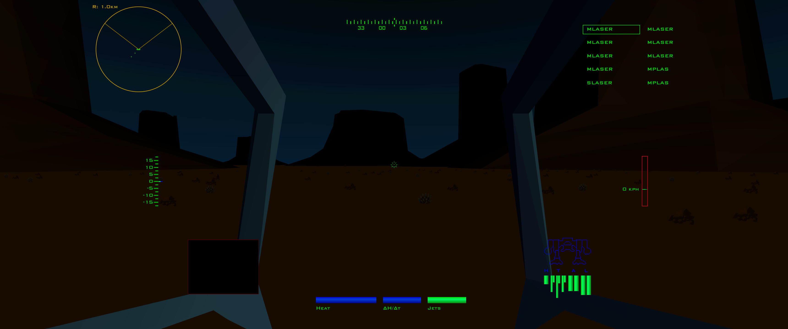
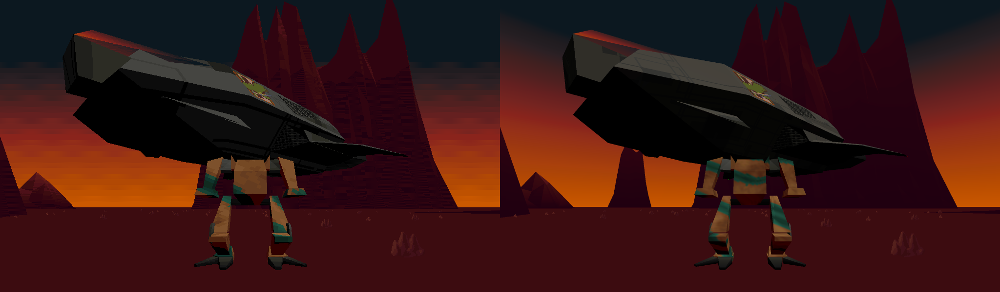
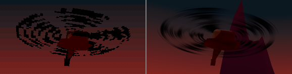
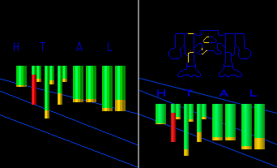

# MechWarrior 2 Enhanced Renderer Mod

An experimental OpenGL renderer mod and collection of fixes for the DOS version
of **MechWarrior 2: 31st Century Combat**.

**Status:** v0.9.0 beta. Expect some rough edges and please report major,
reproducible issues.

**Supported platform:** Windows x64 on Intel or AMD 64-bit hardware. Linux,
Wine, and Windows ARM64 are not supported.



I made this to give my first *MechWarrior 2: 31st Century Combat* playthrough a
polished take on the DOS version's retro aesthetic—and to play it with a
HOTAS. The mod still runs the original game and uses its original assets.
MechWarrior 2 remains in charge of the simulation, missions, AI, controls,
sound, music, and interface.

This is primarily a renderer mod for the 3D missions, with HOTAS support (axis
input only) and a handful of bug fixes for issues that get in the way of
playing. The MW2 shell (that is the non-mission interface) remains native,
with a CRT shader making it more presentable on a modern display.

**[Watch the v0.9.0 showcase video (MP4, 18 MB)](https://github.com/furious-pixel/mw2-enhanced-renderer-mod/releases/download/v0.9.0/mw2-EnhancedRendererModv0.9.mp4)**

## Highlights



*The original game renderer is on the left; the enhanced renderer is on the
right.*



*The enhanced renderer, on the right, gives helicopter rotors a smoother
motion-blurred appearance.*



*The native HTAL display is on the left; the enhanced combined HTAL and damage
wireframe layout is on the right.*

### Rendering

- High-resolution and widescreen mission rendering with 4x supersampling.
- Switch between the enhanced and original game renderers at any time with
  `Ctrl+/`, or place them side by side with `Ctrl+Shift+/`.
- A scalable widescreen HUD using MechWarrior 2's iconic font.
- Higher-precision cockpit motion without the original polygon wobble.
- Crisper rebuilt compass and altimeter displays that retain the original
  visual style.
- Enhanced imaging that keeps explosions, weapon effects, jump-jet puffs,
  flags, and other sprites textured instead of using placeholder geometry
  which ruins immersion.
- Full mission render distance. This remains experimental and may interfere
  with or spoil some missions.
- Better model LOD selection and reduced terrain seams.
- Motion-blurred helicopter rotors and aeroplane lift fans.
- Bicubic-filtered mech camouflage for a smoother appearance, with repeated
  panel textures adding apparent detail to dropships.
- A combined HUD layout that shows the animated damage wireframe and HTAL
  meters simultaneously, with centered HTAL labels and more intuitive compass
  rotation.

### Gameplay and input

- HOTAS axis mapping and a live input preview in the configurator's Input
  section (run `configure.bat`).
- Frame pacing with 60 and 72 FPS profiles for smoother motion and fewer
  timing-related LRM and audio problems.
- A fix for jump-jet fuel failing to recharge correctly at higher frame rates.

## More detail

### Cockpit and HUD

The cockpit model is composed at higher precision, removing much of the
polygon wobble caused by the original integer-rounded transforms.

The in-mission HUD is redrawn as a resolution-aware OpenGL overlay, with
independent scaling for its layout, panels, text, markers, and camera views
instead of simply stretching the original 640x480 output.

HUD markers, meters, and radar contacts retain smooth motion at the final
output resolution. The compass and altimeter are rebuilt for a crisper result
while preserving the look of the original instruments.

The compass now behaves more intuitively from the cockpit point of view: when
you turn right, the compass moves left along with the world. The original DOS
game moved the compass right as well, an odd behavior that appears to have
been corrected in later MechWarrior 2 games.

The HTAL labels are centered over their armor and internal-structure meters,
and a combined layout can show those meters and the animated damage wireframe
at the same time.

The HUD now uses MechWarrior 2's iconic font. The font used is Squarish Sans
CT, a freely licensed reproduction rather than the Bank Gothic Medium used
for MechWarrior 2 artwork.

The enhanced HUD faithfully reproduces the cockpit startup and shutdown
sequences, the animated damage display, interference on damaged video feeds,
and the damaged satellite uplink's animated glitches.

### Cameras, radar, satellite view, and enhanced imaging

The rear camera is mirrored by default, like a vehicle mirror, and the target
and MFD cameras use the enhanced renderer.

Damaged satellite mode faithfully recreates the original animated degraded
rendering and signal glitches.

Enhanced imaging now keeps explosions, weapon effects, jump-jet puffs, flags,
and other billboards textured and colorful instead of using placeholder
geometry which ruins immersion. HUD camera panes remain normally rendered
while enhanced imaging is active, and the original radial scan reveal is
retained.

### Presentation modes and smoother frame pacing

The package includes tear-free fullscreen launch profiles for 60 and 72 FPS;
either can be used. Instead of adjusting DOSBox's CPU-cycle budget to
approximate a frame rate—a rate that changes with the load of each scene—the
renderer paces frames toward a consistent target. Timers, interrupts, input,
and audio continue running between frames. Besides looking smoother, this
helps avoid timing-sensitive problems such as LRMs exploding immediately
after launch and audio glitches.

You can switch presentation at any time:

| Shortcut | Action |
| --- | --- |
| `Ctrl+/` | Switch between the original game image and enhanced renderer. |
| `Ctrl+Shift+/` | Show the original and enhanced renderers side by side. |
| `Ctrl+Alt+/` | Show the comparison while allowing native 3D rendering to be suppressed. |

The enhanced renderer uses the same brightness setting as the native renderer,
controlled by the brightness slider in the in-mission Escape menu.

## Configuration

Run `configure.bat` to edit the renderer, HUD, and HOTAS axis settings, or edit
the `.conf` files directly. The configurator includes a live preview of the
calibrated turret, chassis-turn, and throttle commands. HOTAS button binding is
not built in; use a tool such as Joystick Gremlin to map buttons to MechWarrior
2 keyboard controls. Joystick input remains disabled until axes are configured.

## Installing

Download the
[v0.9.0 beta release](https://github.com/furious-pixel/mw2-enhanced-renderer-mod/releases/tag/v0.9.0)
and its
[SHA-256 checksum](https://github.com/furious-pixel/mw2-enhanced-renderer-mod/releases/download/v0.9.0/mw2-enhanced-renderer-mod-v0.9.0-windows-x64.zip.sha256).

The release is intended to be self-contained. It includes the mod, its Python
runtime and dependencies, and the required
[dosbox-x-mod](https://github.com/furious-pixel/dosbox-x-mod) host. You do not
need to install Python, uv, or a separate copy of DOSBox-X.

Supported setup:

- Windows x64 on Intel or AMD 64-bit hardware. Linux, Wine, and Windows ARM64
  are not supported.
- Your own copy of **MechWarrior 2: 31st Century Combat for DOS**, updated to
  **version 1.1**. Other editions are not supported.
- Either the included 60 or 72 FPS launch profile.
- The installed DOS game directory and your `.bin`/`.cue` CD image files.

### 1. Copy the game files

After extracting the release, place your files like this:

```text
MW2-EnhancedRenderer/
├── game/
│   ├── MECH2_16B.BIN
│   ├── MECH2_16B.CUE
│   └── c_mech2/
│       └── mech2/  <- complete installed game directory
│           ├── MW2.EXE
│           ├── MW2.PRJ
│           └── ... all other installed game files
├── bin/
├── mw2mods/
├── configure.bat
├── launchmw2_60fps.bat
└── launchmw2_72fps.bat
```

If your DOS copy is not already updated, the
[PCGamingWiki patches section](https://www.pcgamingwiki.com/wiki/MechWarrior_2%3A_31st_Century_Combat#Patches)
links to the correct DOS v1.1 patch.

Run `configure.bat`, open **Game Installation**, and confirm that `MW2.EXE` and
`MW2.PRJ` are verified. The configurator checks the expected directory shown
above; it does not discover a different mount path edited into the DOSBox
configuration.

### 2. Configure the DOS game

In combat variable, set the **"Detail section"** as follows:

| Setting | Value |
| --- | --- |
| Object Textures | On |
| Terrain Textures | On |
| Display Detail | High |
| Object Density | High |
| Chunky Explosions | On |
| Resolution | 1024x768 |

The mod is verified to work only with all effects enabled and the game
resolution set to 1024x768.

After reviewing any other settings in `configure.bat`, run
`launchmw2_60fps.bat` or `launchmw2_72fps.bat` to play—choose whichever better
fits your display refresh rate.

No game files are included with this project or its releases.

## Current limitations

This renderer deliberately concentrates on the playable 3D missions. The MW2
shell, briefings, mission selection, and other non-mission screens remain
native.

A few known rough edges remain:

- Higher frame rates such as 90 FPS are supported by editing the batch file,
  but currently break LRM missiles. Use either the 60 or 72 FPS profile for
  normal play.
- Full render distance may interfere with or spoil how some missions are
  intended to play.
- Occasionally, pressing `Esc` during a mission can terminate the mission with
  a `divide overflow` error. Similar errors are known to other MechWarrior 2
  players, but the cause in this setup is not yet understood.
- The renderer preloads all mission textures. It releases each game-side
  resource after copying it, allowing the game's cache to purge it, but the
  timing of that purge has not been confirmed. Some missions may therefore run
  into resource-cache pressure during loading.
- Terrain correction greatly reduces cracks, but a few residual seams may
  remain.
- The original game applies fill lighting to mechs and other objects, and
  makes them brighter as they take damage, in both normal and
  light-amplification modes. The enhanced renderer does not yet reproduce
  these effects.
- Impact red-out can differ slightly from the native ground color.

## Issues

Reports of major reproducible issues are welcome and appreciated. Please
report them through
[GitHub Issues](https://github.com/furious-pixel/mw2-enhanced-renderer-mod/issues).

## A note on the bundled DOSBox-X

This project uses
[dosbox-x-mod v0.2.0](https://github.com/furious-pixel/dosbox-x-mod/releases/tag/v0.2.0),
an experimental DOSBox-X fork made to support this mod. It can load Python
mods and supports OpenGL renderers, and is bundled so the release is ready to
use after you add your own game files.

The fork is not an official DOSBox-X release. General DOSBox-X information and
the upstream project are available at
[joncampbell123/dosbox-x](https://github.com/joncampbell123/dosbox-x).

## Developing from source

To run the mod from a source checkout on Windows, install
[uv](https://docs.astral.sh/uv/) and create the locked Python environment from
the repository root:

```powershell
uv sync --frozen
```

Download the pinned
[dosbox-x-mod v0.2.0 Windows x64 SDL2 archive](https://github.com/furious-pixel/dosbox-x-mod/releases/download/v0.2.0/dosbox-x-windows-x64-sdl2-v0.2.0.zip)
and extract its contents into `bin/`. The resulting layout must include
`bin/dosbox-x.exe` and `bin/glshaders/`. Then add your own game files as shown
under [Installing](#installing), run `configure.bat`, and use either launch
profile normally. Building DOSBox-X or installing the Python dependencies
individually is not required.

## How the mod works

The bundled dosbox-x-mod embeds Python and calls the mod at selected points in
MechWarrior 2's frame, rendering, and HUD flow. During each mission frame, the
mod reads the game's live memory to capture the camera, palette, lighting,
objects, geometry, textures, effects, and HUD state. It converts that snapshot
into GPU buffers, renders the enhanced scene into its own OpenGL targets, and
then composites the finished image into the DOSBox-X window. The original game
continues to run the simulation, missions, AI, controls, sound, and music.

During the mission loading screen, the mod invokes the game's own resource
functions to force-load textures, model detail levels, and other resources
needed by the enhanced renderer. It copies the required data and releases each
game-side resource again. This extra work is why the loading screen remains
visible for longer before a mission begins.

The renderer and HUD otherwise treat game memory as read-only. The mod writes
to game memory only for configured HOTAS axis input and the jump-jet fuel
recharge fix.

Caching is what keeps this practical in Python. The expensive resource
decoding, texture preparation, geometry parsing, and GPU setup are retained and
reused wherever the game data remains unchanged. Each frame then updates the
moving objects, animations, palette, camera, lighting, HUD, and any geometry
that actually changed instead of rebuilding the entire scene from scratch.

In mod-only presentation, and in comparison mode when native suppression is
enabled, dosbox-x-mod skips the game's native 3D rasterization while leaving
the game itself running. This avoids spending time rendering a second scene
that will not be shown.

## Clean-room reverse engineering

This is a clean-room reverse-engineered implementation built with AI agents.
Reverse-engineering agents analyze the original game on one computer and turn
their findings into behavioral and data-format specifications. Separate
implementation agents on another computer write the mod from those
specifications, without using proprietary source code, copied disassembly, or
decompiler output as implementation input. When a specification needs
clarification, narrow runtime instrumentation and memory observation is used
to test the game's behavior.

## A note on the code

Python is not the obvious choice for an efficient real-time renderer. Object
allocation and garbage collection can cause hitches, so the renderer tries to
avoid object churn in frequently repeated work. The hottest geometry,
transformation, lighting, and buffer-filling paths use batched Numba kernels
over typed arrays instead of ordinary Python loops.

A full reimplementation of the game would be far cleaner and way more
efficient. Much of this renderer exists to deal with how the original game
stores live objects in memory, follow its data structures, and parse them
efficiently each frame without replacing the game itself.

I chose Python for fast prototyping and data analysis, which made it possible
to investigate the game and iterate quickly. Current agentic AI is remarkably
good at reverse engineering and writing optimized numeric kernels, although it
still tends to produce more code than necessary—something that is likely to
improve as agentic AI matures.

## Acknowledgements

Thanks to @anpage for [documenting the high-frame-rate jump-jet fuel issue in
detail](https://gist.github.com/anpage/9b5ec3d72200117e224b2e696e8b4280),
which helped me understand the fuel-recharge issue in depth.

Thanks to @Kaidine for the [MechWarrior Joystick
Guide](https://github.com/Kaidine/Mechwarrior-Joystick-Guide/blob/main/mechwarrior%202/31st%20century%20combat/setup%20instructions.md#play-the-game),
which made me aware that *MW2: 31CC* uses zero-order absolute joystick
positioning. That informed the mod's HOTAS axis support for both
absolute-position and relative-rate control.

## Credits and license

The MechWarrior 2 Enhanced Renderer mod is an unofficial fan project and is
not affiliated with or endorsed by the creators or publishers of MechWarrior
2. All game names and trademarks belong to their respective owners.

Except where otherwise noted, the mod's original code and original assets are
licensed under the GNU General Public License version 2 or any later version
(GPL-2.0-or-later). See `LICENSE` for the license text and `COPYRIGHT` for its
scope. DOSBox-X, the bundled font, Python, and the Python/OpenGL dependencies
retain their own licenses, documented in `THIRD_PARTY_NOTICES.md` and the
license files shipped with them.

The mod does not include or redistribute MechWarrior 2 itself.

Thanks to the DOSBox-X project and to the open-source projects that make the
renderer possible, including ModernGL, NumPy, Numba, FreeType, PySDL2, and
PyWebView.
