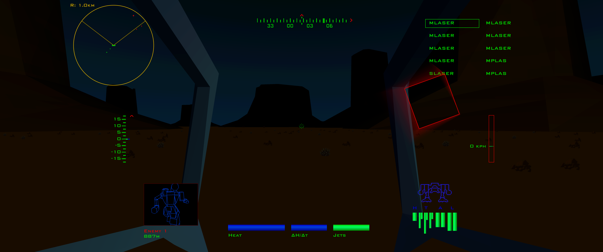
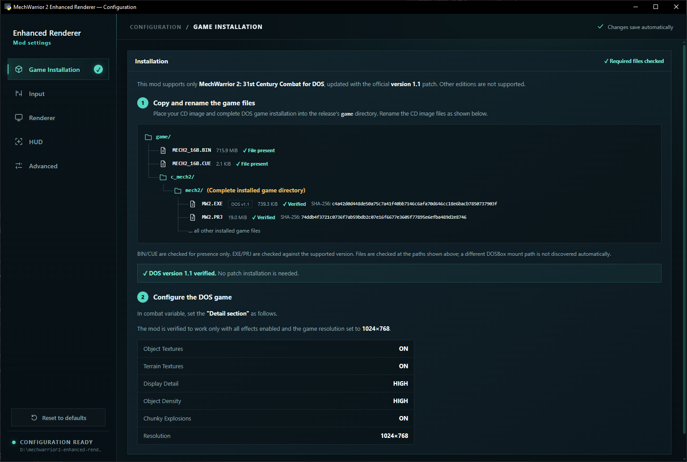
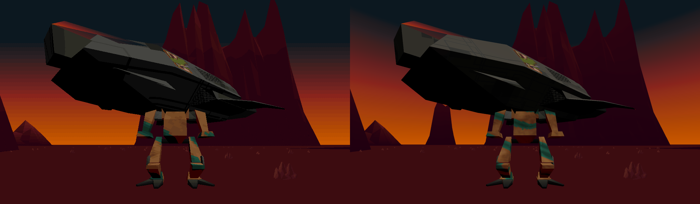
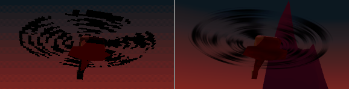
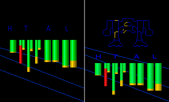

# MechWarrior 2 Enhanced Renderer Mod

Play **MechWarrior 2: 31st Century Combat for DOS** with high-resolution
widescreen rendering, a rebuilt HUD, smooth animations, and HOTAS axis support,
while keeping the original game's assets and retro visual style.

**[Download](https://github.com/furious-pixel/mw2-enhanced-renderer-mod/releases/latest)**
· [Installation](#installation) · [Features](#features)
· [Configuration](#configuration) · [Known limitations](#known-limitations)



**Status:** All in-mission rendering and view modes are fully supported,
including weapon and damage effects, HUD startup and shutdown animations,
and HUD and satellite glitch effects. Some rough edges remain; see
[known limitations](#known-limitations). Non-mission screens use the original
renderer with a CRT shader.

**Requirements:** Windows x64 on Intel or AMD hardware, your own DOS copy of
*MechWarrior 2: 31st Century Combat*, and its CD image. The game must be patched
to version 1.1; the configurator walks you through this. Other game editions,
Linux, Wine, and Windows ARM64 are not supported.

I made this to give my first MechWarrior 2 playthrough a polished take on the
DOS version's aesthetic—and to play it with a HOTAS. The original game still
runs the simulation, missions, AI, sound, music, and interface.

## Features

### Rendering

- **High-resolution widescreen missions** with 4× supersampling,
  higher-precision cockpit motion, and reduced polygon wobble.
- **A rebuilt high-resolution HUD using MechWarrior 2's iconic font,** with
  configurable scaling and panel positioning for widescreen displays.
  Crisper compass and altimeter displays retain the original visual style.
- **Smooth HUD animations:** startup and shutdown sequences, moving
  instruments, and animated target acquisition with configurable rotation,
  duration, and motion trails.
- **Smooth palette transitions** for mission fade-ins, day/night transitions,
  and light-amplification changes.
- **A combined damage display** showing the animated damage wireframe and
  armor/internal-structure (HTAL) meters together. The wireframe supports
  automatic or fractional manual scaling, with custom CRT smoothing,
  scanlines, and glow.
- **Enhanced camera and imaging views,** including a mirrored rear camera,
  target and multi-function display cameras, and satellite view. Enhanced
  imaging retains textured weapon effects, explosions, and other sprites,
  along with the original radial scan reveal.
- **Improved scene detail:** smoother mech camouflage, repeated panel textures
  on dropships, better model detail selection, reduced terrain seams, and
  motion-blurred helicopter rotors and aircraft lift fans. Full mission render
  distance reveals more of the landscape, but can affect mission surprises.

### Gameplay and input

- **HOTAS axis support** with direct-position or relative-rate aiming,
  adjustable response curves, and a live control preview in the configurator.
- **Consistent frame pacing** toward a selected FPS target, with timers,
  input, and audio continuing between frames.
- **Jump-jet fuel recharge fix** for higher frame rates.

## Installation

1. **[Download the Windows x64 release](https://github.com/furious-pixel/mw2-enhanced-renderer-mod/releases/latest)**
   and extract it into a fresh directory.
2. **Run `configure.bat` and follow the Game Installation tab.** It shows
   where to place your complete installed DOS game and how to name your
   `.bin`/`.cue` CD image files. **If you had to rename the .bin / .cue files,** open the `.cue`
   file in a text editor and change the filename in its first line to
   `MECH2_16B.bin`, keeping the rest of the line unchanged.
   Confirm that both CD image files show as
   **File present** and that `MW2.EXE` and `MW2.PRJ` show as **Verified**.
   CD image files are checked for presence only. The tab identifies supported
   `MW2.EXE` versions, shows patch instructions when v1.0 is detected, and
   lists the required in-game detail settings.
3. **Review the Input, Renderer, and HUD tabs** to suit your controls and
   display. Settings save automatically. Keyboard users can leave joystick
   input disabled.
4. **Run a `launchmw2_<FPS>fps.bat` launcher.** Choose the FPS version closest
   to your monitor's refresh rate. FPS selection is manual for now.

[](media/configure-installation.png)

*Game Installation after all required files are found and verified (v0.11.0).*

Keep the **in-game resolution at 1024×768** and enable the effects listed in
the installation tab. This is the original game's internal resolution; the
enhanced renderer draws at your output resolution, including widescreen.

The release includes the required DOSBox-X host, Python runtime, and
supporting dependencies. You do not need to install Python, uv, or a separate
copy of DOSBox-X. **No game files are included.**

## Screenshots and video



*Original renderer on the left; enhanced renderer on the right.*

### Rotor motion



*The enhanced renderer, on the right, adds motion-blurred rotors.*

### Damage display



*Original armor meters on the left; combined meters and damage wireframe on
 the right.*

[Watch the earlier v0.9.0 showcase (MP4, 18 MB)](https://github.com/furious-pixel/mw2-enhanced-renderer-mod/releases/download/v0.9.0/mw2-EnhancedRendererModv0.9.mp4).
It shows an earlier release; the current renderer and HUD have since improved.

## Configuration

Run `configure.bat` whenever you want to adjust the mod. Changes save
automatically to the `.conf` files, which can also be edited directly.

| Tab | What it contains |
| --- | --- |
| **Game Installation** | Game-file verification, file placement, patch instructions, and required in-game settings. |
| **Input** | Joystick/HOTAS axis assignments, calibration, response curves, aiming mode, and live control preview. |
| **Renderer** | Antialiasing, field of view, model detail, enhanced imaging, textures, and rotor/terrain treatments. |
| **HUD** | Scaling, panel placement, instruments, damage wireframe, rear-camera mirroring, and target acquisition. |
| **Advanced** | Specialist renderer and diagnostic options; most players can leave these at their defaults. |

### HOTAS setup

Configure and enable joystick input in **Input**, then use the live preview to
check turret aiming, chassis turn, and throttle. No DOSBox-X or in-game
joystick setup is needed. Button mapping is separate: use a tool such as
Joystick Gremlin or JoyToKey to map buttons to the game's keyboard controls.

### HUD and presentation

In the configurator's **HUD → Resolution scaling** section, adjust **Panel
scaling** and **Font scaling** to suit your display size and comfortable
reading distance. Typically, keep both at the same value so the artwork and
text stay in proportion. Both default to **1.0 (100%)**, scaling with viewport
height; reduce them together if the HUD feels too large on your display.

HUD text, panels, markers, and camera views can also be scaled independently.
The damage wireframe's **Auto** setting follows the display size; manual
scales can be fractional when **Damage wireframe CRT smoothing** is enabled.
The rebuilt font uses Squarish Sans CT, a freely licensed reproduction of the
original visual style.

Use the in-mission Escape menu's brightness slider to adjust brightness for
both the original and enhanced renderers.

| Shortcut | Action |
| --- | --- |
| `Ctrl+/` | Switch between the original and enhanced renderers. |
| `Ctrl+Shift+/` | Show both renderers side by side. |
| `Ctrl+Alt+/` | Show the comparison while allowing native 3D rendering to be suppressed. |

### Level tweaker

Run `launch_level_tweak.bat` to open the game and the level tweaker together.
The launcher places the panel below the game when there is enough vertical
space, otherwise beside it. The panel closes when DOSBox exits, after any
active save finishes. To reopen it during the same launch, run
`level_tweaker.bat <channel>` using the channel printed by the launcher.

In a mission, preview view-distance presets or a custom distance. **Save**
writes the override to `mw2mods/user_level_overrides.json`. The simulation
speed buttons select **¼×**, **Normal**, or **8×**, without changing audio
speed. Speed changes are temporary: disconnecting the panel or starting a
new mission restores the previous setting unless the game's own cheats
changed it afterward. Simulation speed is never saved with distance overrides.

## Updating

Extract the new release into a fresh directory, then copy these from your
previous installation:

- `game/`
- `mw2mods/mod.conf`
- `mw2mods/joystick.conf`, if present
- `mw2mods/user_level_overrides.json`, if present

Your existing settings carry over. You can launch immediately, or run
`configure.bat` to review newly available options.

## Known limitations

- Shell screens, briefings, and mission selection retain the original game
  rendering, with a CRT shader for presentation on modern displays.
- Full render distance may reveal things earlier than intended and spoil or
  interfere with some missions.
- Occasionally, pressing `Esc` during a mission can end it with a
  `divide overflow` error. The cause in this setup is not yet understood.
- A few terrain seams may remain despite terrain correction.
- Impact red-out can differ slightly from the native ground color.

Please report reproducible problems through
[GitHub Issues](https://github.com/furious-pixel/mw2-enhanced-renderer-mod/issues).
Include your release version, hardware, relevant settings, and steps to
reproduce the problem. Screenshots help with visual issues.

## How it works

The renderer was prototyped in Python and is now implemented in C++ and
OpenGL. A modified [DOSBox-X host](https://github.com/furious-pixel/dosbox-x-mod)
passes live camera, geometry, palette, texture, and HUD state through a
versioned DLL interface. The renderer retains decoded assets and GPU resources
across frames, renders the scene, and composites it into DOSBox-X. The original
game remains responsible for gameplay.

Python is still used for input/gameplay mods and the configurator. The native
renderer lives in `mw2mods/mw2renderer.dll`; FreeType is privately linked into
it. The package needs the matching native-renderer host, so use the bundled
DOSBox-X rather than substituting a standard release or an older Python-era
host. Its exact revision and binary hash are recorded in `BUILD_INFO.json`.
This fork is not an official [DOSBox-X](https://github.com/joncampbell123/dosbox-x)
release.

### Developing from source

On Windows, install [uv](https://docs.astral.sh/uv/) and create the locked
Python environment from the repository root:

```powershell
uv sync --frozen
```

Follow the [native renderer build instructions](src/mw2renderer/README.md)
to build and stage the DLL, and pair it with a matching native DOSBox-X build,
including `bin/glshaders/`. The DLL is generated, not committed to Git.

`tools/package_release.py` assembles the portable release from the renderer's
runtime stage, a prepared host distribution, and the locked Python environment
and base runtime. Run it with `--help` for the required paths.

### Clean-room reverse engineering

This is a clean-room reverse-engineered implementation built with AI agents.
Reverse-engineering agents analyze the original game on one computer and turn
their findings into behavioral and data-format specifications. Separate
implementation agents on another computer write the mod from those
specifications, without using proprietary source code, copied disassembly, or
decompiler output as implementation input. When a specification needs
clarification, narrow runtime instrumentation and memory observation are used
to test the game's behavior.

## Acknowledgements

Thanks to skyfaller and the mech2.org community for the original Farpatcher
view-distance values, which are available as presets in the level tweaker.

Thanks to @anpage for [documenting the high-frame-rate jump-jet fuel issue](https://gist.github.com/anpage/9b5ec3d72200117e224b2e696e8b4280),
which helped me understand the recharge problem.

Thanks to @Kaidine for the [MechWarrior Joystick Guide](https://github.com/Kaidine/Mechwarrior-Joystick-Guide/blob/main/mechwarrior%202/31st%20century%20combat/setup%20instructions.md#play-the-game),
which explained MW2's zero-order absolute joystick positioning and informed
the mod's direct-position and relative-rate HOTAS controls.

Thanks to DOSBox-X and the open-source projects that make the mod possible,
including FreeType, Khronos OpenGL headers, stb, PySDL2, and PyWebView.

## Credits and license

This is an unofficial fan project, not affiliated with or endorsed by the
creators or publishers of MechWarrior 2. Game names and trademarks belong to
their respective owners. The mod does not redistribute MechWarrior 2 itself.

Except where otherwise noted, the mod's original code and assets are licensed
under **GPL-2.0-or-later**. See [LICENSE](LICENSE) and [COPYRIGHT](COPYRIGHT)
for the terms and scope. Bundled third-party components retain their own
licenses; see [THIRD_PARTY_NOTICES.md](THIRD_PARTY_NOTICES.md) and the license
files shipped with them.
